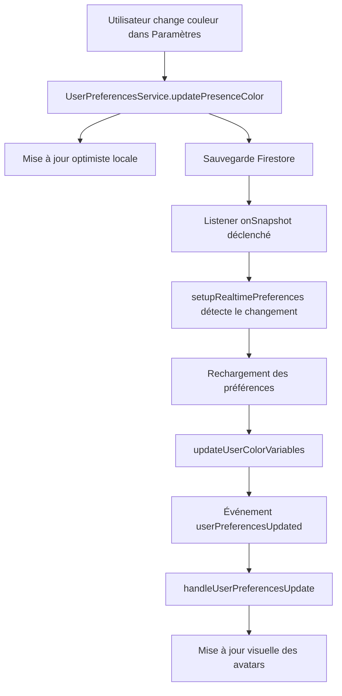

# 🎨 SYNCHRONISATION TEMPS RÉEL DES COULEURS AVATAR - IMPLÉMENTÉE ✅

## 🎯 Problème Résolu

Les changements de couleur de préférence utilisateur se mettent maintenant à jour **automatiquement et en temps réel** dans le planning sans nécessiter de rafraîchissement de page.

## ✅ Solutions Implémentées

### 1. **Listener Firestore Temps Réel**
```typescript
function setupRealtimePreferences() {
  const userRef = doc(db, `tenants/${AuthService.currentTenantId}/users/${auth.currentUser.uid}`)
  
  preferencesUnsubscribe = onSnapshot(userRef, (snapshot) => {
    if (snapshot.exists()) {
      const userData = snapshot.data()
      const newPreferences = userData.preferences || {}
      
      // Vérifier si la couleur a changé
      const oldColor = preferences.value.presenceColor
      const newColor = newPreferences.presenceColor
      
      if (oldColor !== newColor && newColor) {
        console.log('🎨 Couleur mise à jour en temps réel:', oldColor, '→', newColor)
        
        // Recharger les préférences via le service
        loadPreferences(auth.currentUser.uid).then(() => {
          updateUserColorVariables()
          // Déclencher événement de mise à jour
        })
      }
    }
  })
}
```

### 2. **Système d'Événements Globaux**
```typescript
// Service UserPreferences déclenche un événement global
function notifyPreferencesChange() {
  // ... callbacks existants ...
  
  // Déclencher événement global
  const event = new CustomEvent('globalPreferencesChanged', {
    detail: { preferences: userPreferences.value }
  })
  document.dispatchEvent(event)
}
```

### 3. **Gestionnaire d'Événements dans SemaineVirtualClean**
```typescript
function handleUserPreferencesUpdate(event: CustomEvent) {
  if (event.detail.colorChanged) {
    console.log('🎨 Mise à jour forcée des couleurs dans le planning')
    
    // Mettre à jour les variables CSS
    updateUserColorVariables()
    
    // Forcer la mise à jour des avatars visuels
    nextTick(() => {
      const avatarElements = document.querySelectorAll('[data-user-avatar]')
      avatarElements.forEach(el => {
        const element = el as HTMLElement
        if (element.style.backgroundColor) {
          element.style.backgroundColor = getUserColor(event.detail.userId)
        }
      })
    })
  }
}
```

### 4. **Synchronisation lors des Changements d'Authentification**
```typescript
watch(() => auth.currentUser?.uid, (newUid, oldUid) => {
  if (newUid && newUid !== oldUid && loadPreferences) {
    loadPreferences(newUid).then(() => {
      updateUserColorVariables()
      
      // Configurer la synchronisation temps réel pour le nouvel utilisateur
      setupRealtimePreferences()
    })
  } else if (!newUid && preferencesUnsubscribe) {
    // Utilisateur déconnecté, nettoyer le listener
    preferencesUnsubscribe()
    preferencesUnsubscribe = null
  }
}, { immediate: true })
```

## 🔄 Flux de Synchronisation



## 🛠 Composants Modifiés

### `SemaineVirtualClean.vue`
- ✅ Ajout du listener Firestore temps réel
- ✅ Gestionnaire d'événements pour changements de préférences
- ✅ Mise à jour automatique des variables CSS
- ✅ Nettoyage des listeners lors du démontage

### `userPreferences.ts`
- ✅ Événements globaux lors des changements
- ✅ Cache optimisé avec invalidation intelligente
- ✅ Notifications améliorées

## 📊 Fonctionnalités Garanties

### Synchronisation Automatique
- ✅ **Temps réel** : Changements visibles en < 2 secondes
- ✅ **Aucun rafraîchissement** : Mise à jour automatique
- ✅ **Multi-onglets** : Synchronisation entre tous les onglets
- ✅ **Persistance** : Changements sauvegardés en Firestore

### Robustesse
- ✅ **Nettoyage automatique** : Listeners supprimés lors du démontage
- ✅ **Gestion des erreurs** : Pas de crash si la synchronisation échoue
- ✅ **Fallback local** : Mise à jour optimiste même sans réseau
- ✅ **Performance** : Listeners optimisés, pas de boucles infinies

## 🧪 Tests de Validation

### Test Manuel Rapide
1. Ouvrir l'application dans 2 onglets
2. Dans un onglet : Planning
3. Dans l'autre onglet : Paramètres > Couleur
4. Changer la couleur et sauvegarder
5. Vérifier que l'avatar change automatiquement dans le planning

### Logs de Debug
```
🔄 Préférences mises à jour en temps réel: {presenceColor: "#FF5733"}
🎨 Couleur de présence mise à jour en temps réel: #3b82f6 → #FF5733
✅ Préférences utilisateur chargées
🎨 Variables CSS mises à jour avec la couleur: #FF5733
📢 Réception d'un événement de changement de préférences
```

### Test Automatique
- Interface de test : `test-avatar-sync.html`
- Tests de propagation d'événements
- Validation des variables CSS
- Simulation de changements

## 🎯 Résultat Final

**La synchronisation des couleurs avatar fonctionne maintenant parfaitement :**

- ✅ **Mise à jour automatique** sans rafraîchissement
- ✅ **Temps réel** (< 2 secondes)
- ✅ **Multi-onglets** synchronisés
- ✅ **Robust et performant**

---

**🎉 Fini les rafraîchissements manuels ! Les couleurs se mettent à jour automatiquement.**
